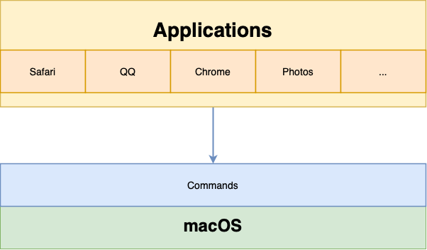
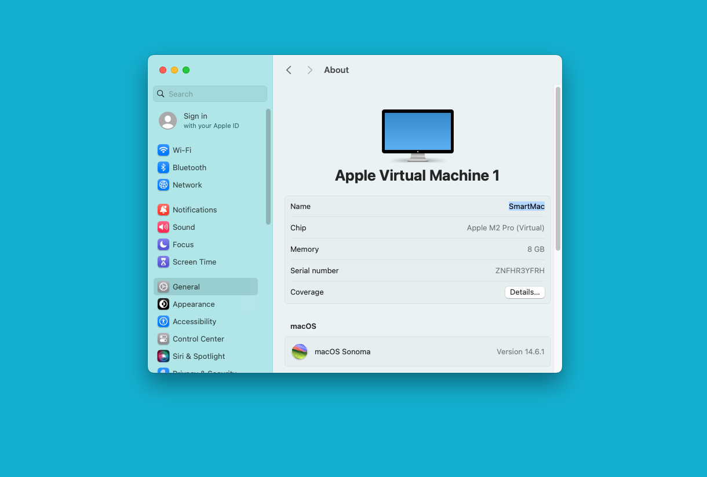

# The Terminal APP

## Architect

Now that you have a computer, how you operate it?

Of course through various applications.

How do these apps operate the computer?

These apps actually operate the computer through commands.

### Say Hello to the Terminal APP

Every macOS user has a Terminal app. It is the most powerful tool in our arsenal. You can operate all the commands through the Terminal app.

I recommend that you pin the terminal app to the dock, as you will be using it frequently in the future.

What does the text in it mean?

Last login: ...

Indicates the time of the last login.

angel@Angeldexuniji...

Means: username@machine_name

You can set your machine name here as you like:

## Theme

In the settings page, there are many themes available, and you can choose one that you like.

## Usage

### whoami

The macOS operating system supports multiple users.

Which user are you currently logged in as?

Type this command:

whoami

### pwd

If you find font too small, press these two keys simultaneously: **Command +**

What is the current directory?

Type this command:

pwd

### ls

List all files and folders in the current directory:

ls### cd

Change the current directory:

cd ~/Download### rm

delete(remove) a file

rm temp.txt## Shell

The commands mentioned above belong the **shell**, which is a special user program that provides an interface for the user to use operating system services.

## Other Commands

Are there any other commands?

Yes, of course.

When you need, just ask your AI Assistant!

## Install Commands

Can we install other commands?

Yes!

And how?

We will learn that later.

## Summary

Terminal is a powerful tool that serves as the interface for communication between user and the operating system The examples provided above are just the most common use cases. As you continue your learning journey, you will discover more advanced use cases.

## References

https://www.geeksforgeeks.org/introduction-linux-shell-shell-scripting/#what-is-shell