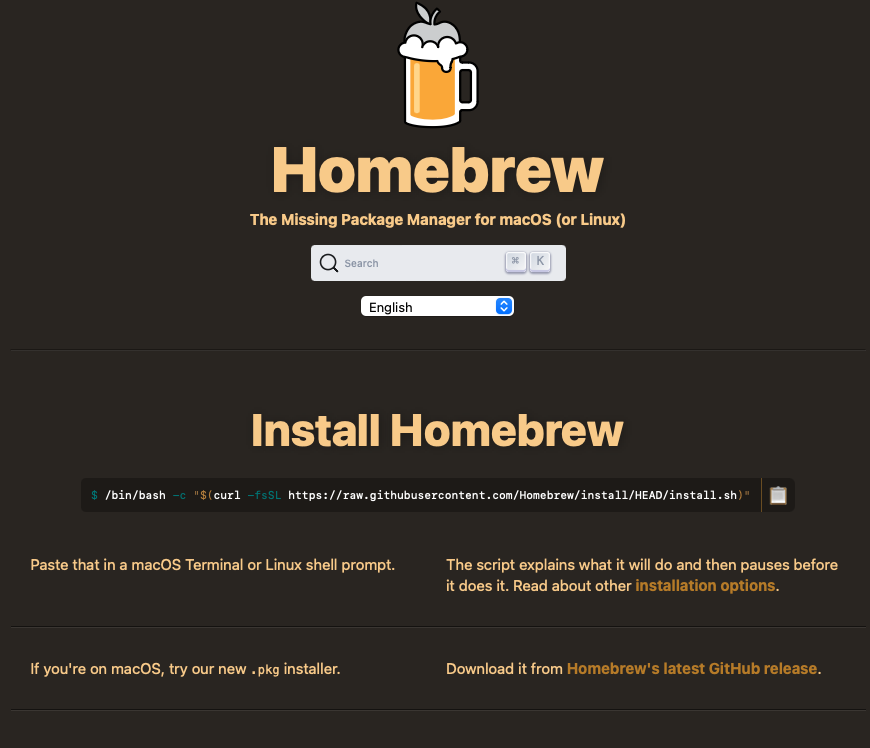

# Homebrew

## Instruction

What is Homebrew?

It is a software helps us install and manage softwares.

In the following steps, readers in mainland China may encounter installation failures due to network issues, so you may to address the network problems yourself.

## Install

Now open the official website of Homebrew:

https://brew.sh

Then follow the instructions on the page for installation.

The installation process may take a few minutes since it need to download some softwares.

Also, sometimes it will ask you to enter your password, feel free to input it.

## Install wget

wget is a commonly used command-line download tool. The installation command is as follows:

brew install wget## Basic Usage

**View Installed Software**:

brew list**Update Homebrew**:

brew update**Upgrade Installed Software**:

brew upgrade wget**Uninstall Software**:

brew uninstall wgetBy using these commands, you can familiarize yourself with the basic usage of Homebrew.

## FAQ

**How do I uninstall Homebrew?**https://docs.brew.sh/FAQ#how-do-i-uninstall-homebrew

If you encounter any issues, be sure to check the official documentation for answers first.

## Summary

Now, you should understand that some software not have a user interface and is run through commands.