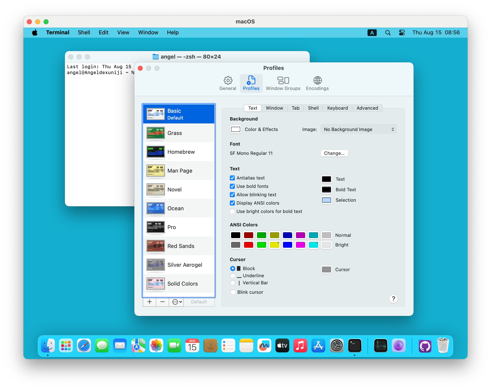

# The Terminal APP

## Architect

Now that you have a computer, how you operate it?

Of course through various applications.

How do these apps operate the computer?

These apps actually operate the computer through commands.

### Say Hello to the Terminal App

Every macOS user has a Terminal app. It is the most powerful tool in our arsenal. You can operate all the commands through the Terminal app.

## Usage

### whoami

The macOS operating system supports multiple users.

Which user are you currently logged in as?

Type this command:

### pwd

If you find font too small, press these two keys simultaneously:

Command

+

What is the current directory?

Type this command:

### ls

List all files and folders in the current directory:

### cd

Change the current directory:

### rm

delete(remove) a file

## Shell

The commands mentioned above belong the **shell**, which is a special user program that provides an interface for the user to use operating system services.

## Other Commands

Are there any other commands?

Yes, of course.

When you need, Google it like:

shell command date*

## Install Commands

Can we install other commands?

Yes!

And how?

We will learn that later.

## Summary

Terminal is a powerful tool that serves as the interface for communication between user and the operating system The examples provided above are just the most common use cases. As you continue your learning journey, you will discover more advanced use cases.

## References

[https://www.geeksforgeeks.org/introduction-linux-shell-shell-scripting/#what-is-shell](https://www.geeksforgeeks.org/introduction-linux-shell-shell-scripting/#what-is-shell)