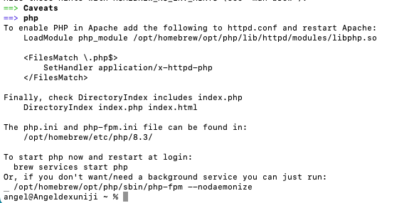
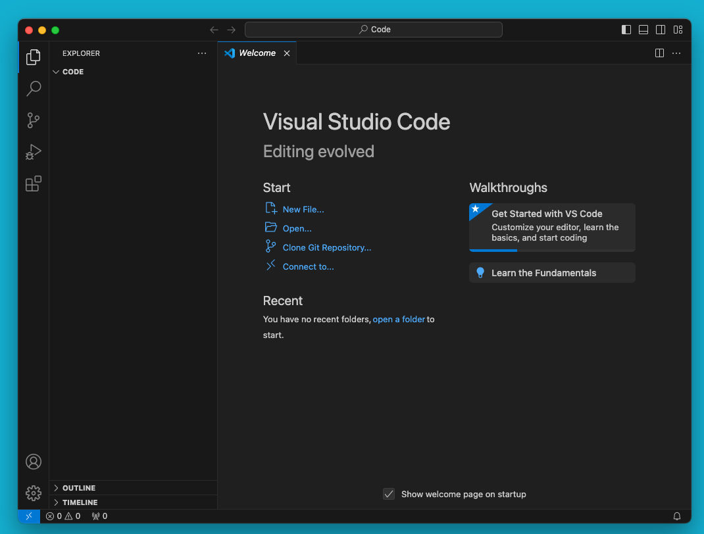
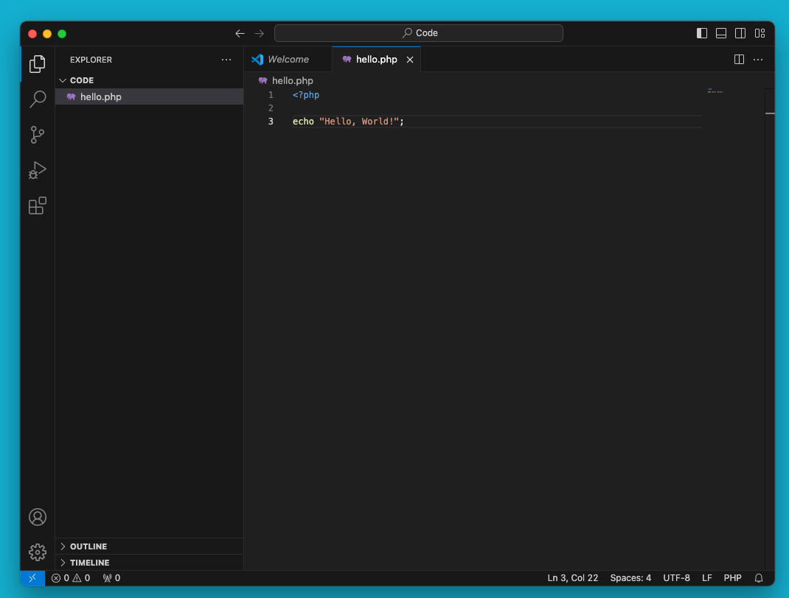

# PHP

## Instruction

PHP, which stands for "Hypertext Preprocessor," is a popular server-side scripting language used for web development.

PHP can perform a range of tasks, but its main purpose is still to create websites.

## Code with AI

Sometimes you may encounter simple questions, such as how to format time, how to concatenate two strings, etc. Don't forget about your AI assistant, they are particularly good at answering these questions.

Here are some great AI assistants:

https://sider.ai

https://openai.com/chatgpt/mac/

https://monica.im

## Installation on macOS

### Install PHP

There are many ways to install PHP, but here we choose the most common and simplest method: installing using Homebrew.

Once Homebrew is installed you can install PHP by running the following command:

brew install phpAt the end of the installation process, you will see something like this:

### Verify Installation

To verify that PHP is installed, run the following command in Terminal:

php -vThis will output the PHP version information, like this:

PHP 8.3.12 (cli) (built: Sep 24 2024 18:08:04) (NTS)
Copyright (c) The PHP Group
Zend Engine v4.3.12, Copyright (c) Zend Technologies
    with Zend OPcache v8.3.12, Copyright (c), by Zend TechnologiesPerhaps what you see here is not exactly the same, but the format is consistent.

## Say Hello to PHP

Next, you will learn how to run a PHP file.

My workspace folder is: ~/Code, so I open it with this command:

cd ~/Code &amp;&amp; code .Here is the result:

### Create

Open Visual Studio Code. Write your PHP code, for example:

&lt;?php

echo "Hello, World!";Save the file with a .php extension, example hello.php.

### Run

Click ’New Terminal’ to open a terminal:

Run the PHP file using the following command:

php hello.phpYou should see the output Hello, World!* in the Terminal.

### Print the time

Follow the steps below to print the time.

Create a new file called time.php in your workspace folder

Write the following code in the file:

&lt;?php
echo date("Y-m-d H:i:s");
Enter this code within the terminal and hit enter to run:

php time.php
If you see the following output, congratulations! You have successfully printed the time.

2021-12-31 16:45:09
If you find something difficult to deal with, ask your AI assistant without hesitation.

### Function

Create a new file called function.php in your workspace folder.

Write a function to print the Fibonacci sequence. Fill in the missing code.

&lt;?php

echo fibonacci(100);

function fibonacci($n) {
    // your code here
}### Array Sorting

Create a new file called array_sorting.php in your workspace folder.

Here is a function that takes two arrays and merges them into one and sort in ascending order.

Fill in the missing code.

&lt;?php
$a = [1, 2, 5];
$b = [3, 4];

$c = array_merge_and_sort($a, $b);
print_r($c);

function array_merge_and_sort($a, $b) {
    // your code here
}The array c should be: [1,2,3,4,5].

### HTTP Server

Create a new file called http_server.php in your workspace folder.

Create a HTTP server that listens on port 8000 with this shell command:

php -S localhost:8000 http_server.phpWhen the user accesses the homepage, print "Hello World!".

&lt;?php
// your code hereFinally, open the link in your browser.

This is the basic principle of developing web pages.