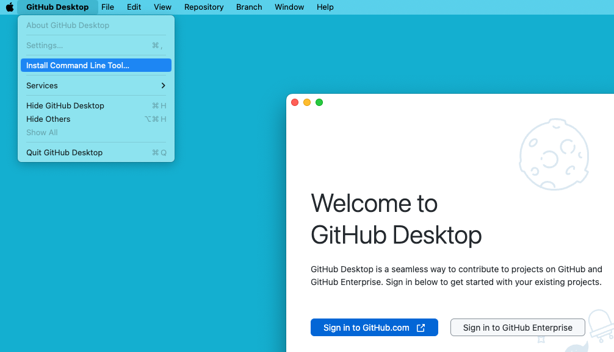

# GitHub

**Users in Mainland China may sometimes experience difficulties accessing the GitHub website, and you will need to find a solution on your own.**

## What is Git &amp; GitHub

Git is a version control system. It allows you to track changes in your files and revert back to previous versions if needed. Git also allows multiple people to work on the same project at the same time.

GitHub is a cloud-based hosting service that lets you manage and collaborate on code projects. It provides access control and several collaboration features such as bug tracking, feature requests, task management, continuous integration and wikis for every project.

## Register for GitHub

Please create a GitHub account, as it is necessary for the upcoming learning.

Registering a GitHub account isn't very difficult, you should be able to do it yourself.

## Install Git

You can use the following command to install Git:

brew install gitAfter installation is complete, enter this code in the terminal app and hit enter to run.

git -vIf you see the following output, congratulations! You have successfully installed GIT.

git version 2.39.3 (Apple Git-146)Look, many commands have a -v option.

## Install GitHub Desktop

What is GitHub Desktop?

GitHub Desktop is a free and open-source graphical user interface for Git. It provides a visual representation of the workflow that occurs when using Git, including a timeline of commits, branches, and files

Simply put, it helps us manage code.

Please refer to https://desktop.github.com for more information.

## Install “github” Command

This command is very useful, let's install it.

## References

https://github.com/apps/desktop

https://git-scm.com