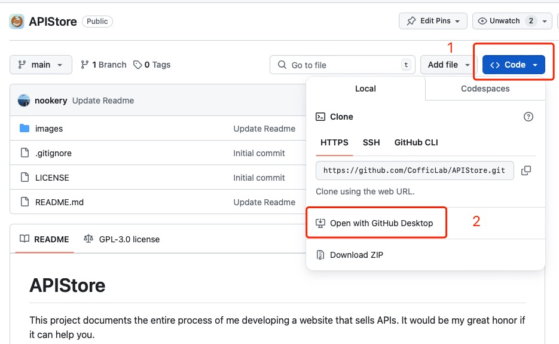

# GitHub

This article is still in the draft stage, so its content may change.## What is that

GitHub is a cloud-based hosting service that lets you manage and collaborate on code projects. It provides access control and several collaboration features such as bug tracking, feature requests, task management, continuous integration and wikis for every project.

simply put, github is a cloud-based hosting service that lets you manage and collaborate on code projects.

## Install GitHub Desktop

What is GitHub Desktop?

GitHub Desktop is a free and open-source graphical user interface for Git. It provides a visual representation of the workflow that occurs when using Git, including a timeline of commits, branches, and files

Simply put, it helps us manage code.

Please refer to [https://desktop.github.com](https://desktop.github.com/) for more information.

After installation is complete, try to open this project with GitHub Desktop with the following steps:

