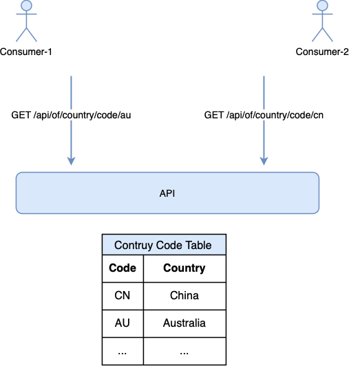
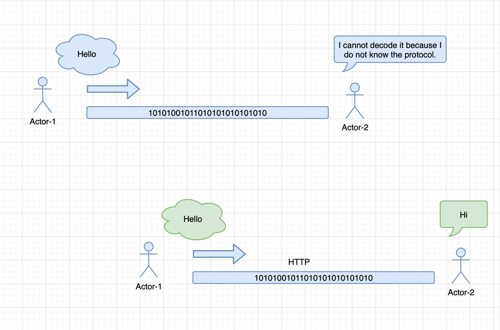

# API Products

This article is still in the draft stage, so its content may change.

## What is API

## What is HTTP

HTTP is a protocol for transferring data.

## Country Info API

Please create a new project called “**country_info**” on your GitHub page.

The programming language is not restricted.

You can use Java, Golang, PHP or any other language.

### Input

any keyword

### Output

counrty information, like:

{

“code”: 244,

“en”: “Angola"

}

Maybe you have no idea where to get the data, here is the answer:

[https://github.com/wyq2214368/country-info](https://github.com/wyq2214368/country-info)

### Production-ready

Please consider the following aspects:

What if the user inputs a very long keyword

What if the user makes 10,000 requests in 1 second

Is there a limit on request frequency

### Attentions

You should create a **README.md** file

Your **README.md** file should tell others:

How to run this project

How to use the API

This link may helps: [https://github.com/RichardLitt/standard-readme](https://github.com/RichardLitt/standard-readme)

## IP Region API

Please create a new project called “**ip2region**” on your GitHub page.

The programming language is not restricted.

You can use Java, Golang, PHP or any other language you prefer.

### Input

an ip address

### Output

Location information, like:

{

“area”: “China"

}

Maybe you have no idea where to get the data, here is the answer:

[https://github.com/zoujingli/ip2region](https://github.com/zoujingli/ip2region)

### Attentions

You should create a README.md file to tell others how to use

## Area Code API

Please create a new project called “**area_code**” on your GitHub page.

The programming language is not restricted.

You can use Java, Golang, PHP or any other language.

### Input

Aera code. For example:420822

### Output

Location information, like:

{

“area”: “湖北省 荆门市 沙洋县"

}

Maybe you have no idea where to get the data, here is the answer:

[https://github.com/cn/GB2260](https://github.com/cn/GB2260)

### Attentions

You should create a **README.md** file to tell others how to use