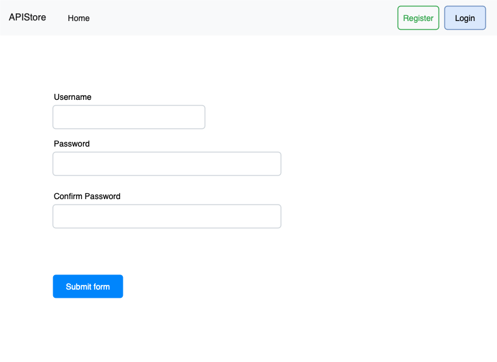
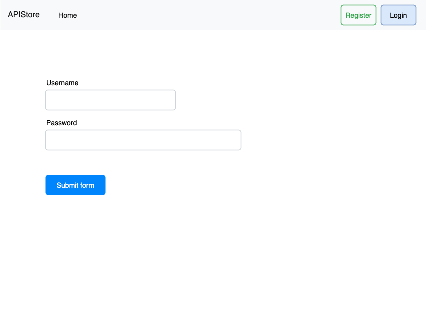

# API Store

This article is still in the draft stage, so its content may change.

It's time to build something amazing with Laravel.

Now modify the code in luckara directory to build a web application as shown in the following image.

## HomePage

### Requirements

Set DB_CONNECTION to: sqlite

Each user has a unique username

Each product has a unique id

Create database tables with Laravel Migrations: https://laravel.com/docs/11.x/migrations

Fill some data with Laravel DB Seeder: https://laravel.com/docs/11.x/seeding

Build the pagination part with: https://laravel.com/docs/11.x/pagination

You should known the usage of the following commands

php artisan db:wipe

php artisan db:seed

php artisan migrate

php artisan migrate:fresh

php artisan migrate:refresh

Display data on the page with Laravel Blade: https://laravel.com/docs/11.x/blade

## Artisan Console

Artisan is the command line interface included with Laravel. Artisan exists at the root of your application as the artisan script and provides a number of helpful commands that can assist you while you build your application. To view a list of all available Artisan commands, you may use the list command:

php artisan listIt is an excellent tool for quickly realizing your ideas.

Learn how to create command: https://laravel.com/docs/11.x/artisan

Then make the following commands:

php artisan product:create {name} -&gt; to create a new product and store it to the database

php artisan user:create {name} -&gt; to create a new user and store it to the database

php artisan product:delete {id}

php artisan user:delete {username}

php artisan user:rename {old} {new}

## Register Page

### Requirements

Show error information if necessary

### Attentions

What if the username has been registered by another user

How to prevent someone from registering accounts unlimited times

The key point is to never trust user input data

## Login Page

### Requirements

Show error information if necessary

### Attentions

What if the user has already logged in

How to prevent someone from unlimited attempts when he forget the password

The key point is to never trust user input data

## Summary

Now, please make the website more robust and aesthetically pleasing.

You are free to add and modify features without limitations.