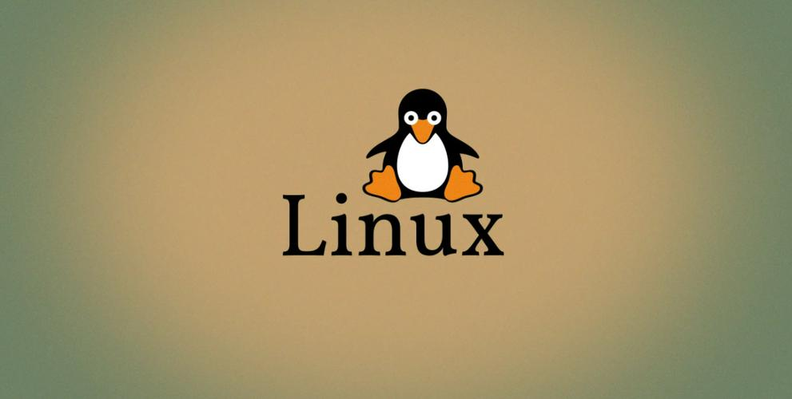

# Linux

This article is still in the draft stage, so its content may change.

## Say Hello to Linux

Linux is a free and open-source operating system which is widely used on servers.

## Install Ubuntu

Ubuntu is a free and open-source operating system. It is based on Debian Linux.

OrbStack is a software that can help you install Ubuntu on your macOS. Install the software and then install Ubuntu on your computer.

download and install OrbStack: https://orbstack.dev

install Ubuntu within the OrbStack App

## Install applications within Ubuntu

install PHP

install Composer