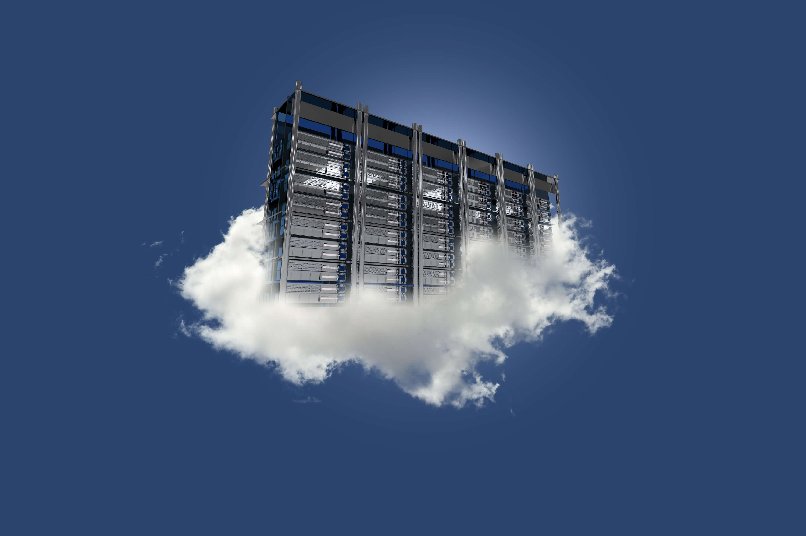
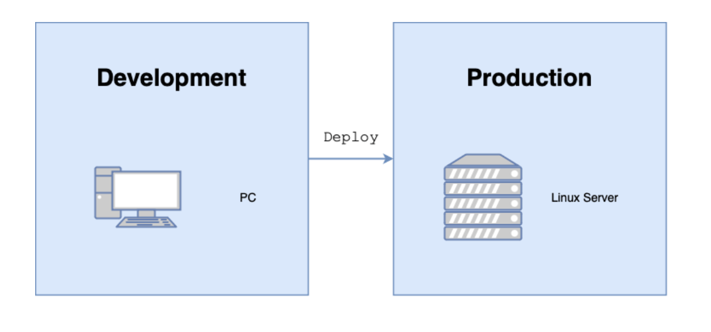

# Cloud Server

This article is still in the draft stage, so its content may change.

## What is Cloud Server

Simply put, a cloud server is a computer that doesn’t shut down.

## Why do We Need a Cloud Server

As a software developer, you may need a cloud server for the following reasons:

**Deploying Applications:** Deploy your applications on a cloud server to make them accessible and usable globally.

**Collaboration and Remote Access:** Cloud servers enable team members to remotely access and collaborate on development, testing, and deployment of applications, regardless of their location

## How to Get a Cloud Server

https://cloud.tencent.com/act/pro/free

https://aws.amazon.com/ec2

## Install Softwares

### Update Packages

sudo apt update### Install Softwares

sudo apt install wget## Deploy Your Project to Cloud Server

Publish your project a cloud server so others can access it through a link like:

http://123.456.3.4:8000

### Clone Project

### Install Composer

### Install PHP Packages

Install PHP packages

### Install PHP Extensions

If the output is something like this

Try to install the missing extensions:

Then retry** composer install**

### Run the Project