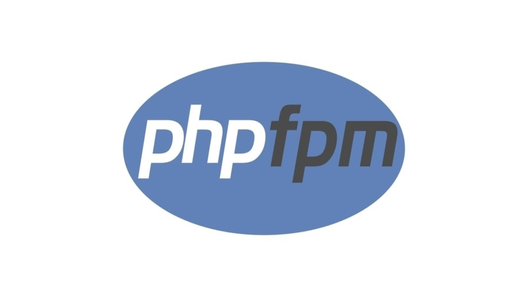

# Using PHP-FPM on macOS

PHP-FPM (FastCGI Process Manager) is an alternative PHP FastCGI implementation that provides significant improvements over the traditional CGI method. It's particularly useful for high-traffic sites. This guide will walk you through installing and using PHP-FPM on macOS, even if you have zero prior experience.

This article is still in the draft stage, so its content may change.

## Prerequisites

Before we begin, ensure you have the following:

1. **macOS**: This guide is specifically for macOS users.

2. **Homebrew**: A package manager for macOS.

## Install PHP with PHP-FPM

1. **Open Terminal**: You can find it in Applications &gt; Utilities &gt; Terminal.

2. **Install PHP**: Use Homebrew to install PHP, which includes PHP-FPM:

3. **Verify Installation**: After the installation completes, verify that PHP and PHP-FPM are installed correctly:

php -v
php-fpm -v## Configure PHP-FPM

1. **Locate the PHP-FPM Configuration File**: The configuration file is usually located at:

/usr/local/etc/php/&lt;version&gt;/php-fpm.d/www.confReplace &lt;version&gt; with the version number you installed (e.g., 8.0).

2. **Edit the Configuration File**: Open the configuration file using a text editor. You can use nano or any other text editor:

nano /usr/local/etc/php/&lt;version&gt;/php-fpm.d/www.confIn this file, you can configure settings such as the user and group under which PHP-FPM runs, listen address, and more. For beginners, the default settings are usually sufficient.

## Start PHP-FPM

1. **Start PHP-FPM**: You can start PHP-FPM using Homebrew services:

brew services start php   2. **Check Status**: To ensure that PHP-FPM is running, use:

brew services list## Test PHP-FPM

1. **Create a Test PHP File**: Create a directory for your PHP files, if you don’t have one already. For example:

mkdir ~/Sites
cd ~/SitesCreate a file named info.php:

echo "&lt;?php phpinfo(); ?&gt;" &gt; info.php2. **Set Up a Local Web Server**: You can use the built-in PHP server for testing purposes. Run the following command in the same directory as your info.php file:

php -S localhost:8000   3. **Access the File in Your Browser**: Open your web browser and go to:

http://localhost:8000/info.phpYou should see a page displaying your PHP configuration information.

Configure Your Web Server (Optional)If you are using a web server like Nginx or Apache, you will need to configure it to work with PHP-FPM.

### For Nginx

1. **Install Nginx**:

brew install nginx   2. **Configure Nginx**: Edit the configuration file located at /usr/local/etc/nginx/nginx.conf to include the following:

   server {

       listen 80;

       server_name localhost;

       root   /Users/your_username/Sites;

       index  index.php index.html index.htm;

       location / {

           try_files $uri $uri/ =404;

       }

       location ~ \.php$ {

           include fastcgi_params;

           fastcgi_pass 127.0.0.1:9000; # Default PHP-FPM port

           fastcgi_index index.php;

           fastcgi_param SCRIPT_FILENAME $document_root$fastcgi_script_name;

       }

   }3. **Start Nginx**:

brew services start nginx4. **Access Your PHP File**: Now you can access your info.php file by going to:

http://localhost/info.php## Conclusion

You have successfully installed and configured PHP-FPM on your macOS machine! This setup allows you to run PHP applications efficiently. As you become more comfortable, you can explore additional configurations and optimizations to suit your needs. If you have any questions or need further assistance, feel free to ask!