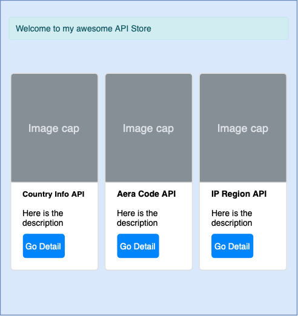

# Build a Website with Laravel

This page documents the entire process of me developing a website that sells APIs. It would be my great honor if it can help you.

## Before you start

All further operations will be performed on macOS because the author uses macOS.

Users in mainland China may encounter many problems, please make sure that your network can smoothly access certain international websites.

## Hire an AI assistant

Do not do everything by yourself. Here are some great AI assistants:

[https://sider.ai/download](https://sider.ai/download)

[https://monica.im](https://monica.im/)

If you encounter any programming problems, try asking your AI assistant first.

## Table Of Contents

[00-Basic_Knowledge](./00-Basic_Knowledge.md)

[01-The_Terminal_APP](./01-The_Terminal_APP.md)

[02-Homebrew](./02-Homebrew.md)

[03-VSCode](./03-VSCode.md)

[04-PHP](./04-PHP.md)

[05-Git](./05-Git.md)

[06-GitHub](./06-GitHub.md)

[07-Laravel](./07-Laravel.md)

[08-API_Store](./08-API_Store.md)

[09-API_Products](./09-API_Products.md)

[10-API_Page](./10-API_Page.md)

[11-Linux](./11-Linux.md)

[12-Cloud_Server](./12-Cloud_Server.md)

[13-CI](./13-CI)

[14-PHP-FPM](./14-PHP-FPM.md)

[15-Laravel_Optimize](./15-Laravel_Optimize.md)

[16-Become_an_expert](./16-Become_an_expert.md)

[17-TailwindCSS](./17-TailwindCSS.md)

[18-Magical_algorithm](./18-Magical_algorithm.md)

[19-Nginx](./19-Nginx.md)

[20-Docker](./20-Docker.md)

[21-Architect](./21-Architect.md)

[22-Kong](./22-Kong.md)

[23-MySQL](./23-MySQL.md)

[24-Redis](./24-Redis.md)

[25-Https](./25-Https.md)